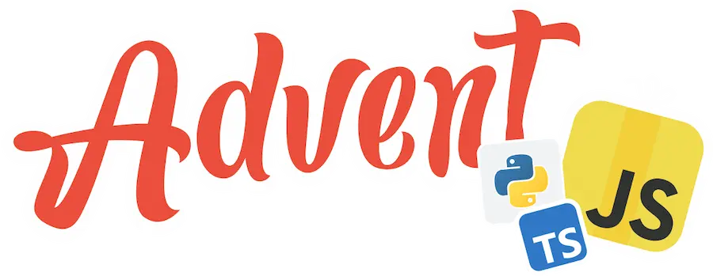

# AdventJS by midudev

- [¿Qué es AdventJS?](#qué-es-adventjs)
- [Características principales de AdventJS](#características-principales-de-adventjs)
- [¿Para quién esta dirigido?](#para-quién-está-dirigido)
- [¿Cómo jugar/participar en AdventJS?](#cómo-jugarparticipar-en-adventjs)
- [Beneficios de participar](#beneficios-de-participar)
- [Retos](#retos)

## ¿Qué es AdventJS?
**AdventJS** es una iniciativa creada por [Midudev](https://www.twitch.tv/midudev "Twitch midudev"), un desarrollador y creador de contenido enfocado en la programación y la tecnología. Es un reto de programación inspirado en el concepto del calendario de adviento, donde cada día, desde el 1 hasta el 24 de diciembre, se presenta un desafío relacionado con el desarrollo web o la programación en JavaScript.

  

## Características principales de AdventJS

1. **Reto diario:**
    Cada día se desbloquea un nuevo desafío, que suele estar enfocado en resolver problemas prácticos o conceptuales usando JavaScript o TypeScript.

2. **Problemas variados:**
    Los desafíos van desde problemas de algoritmos básicos hasta conceptos más avanzados como optimización, manipulación de datos, y lógica de programación.

3. **Puntuación y clasificaciones:**
    Los participantes acumulan puntos por resolver retos y se posicionan en un ranking, promoviendo un ambiente competitivo y divertido.

4. **Enfoque educativo:**
    Los retos están diseñados para que los desarrolladores aprendan nuevas técnicas y refuercen sus habilidades mientras se divierten.

5. **Comunidad activa:**
    Los desarrolladores comparten sus soluciones, discuten estrategias y colaboran a través de plataformas como Discord y redes sociales.

## ¿Para quién está dirigido?
- **Principiantes:**
    Es una excelente manera de practicar JavaScript y mejorar habilidades en lógica de programación.

- **Intermedios y avanzados:**
    Los desarrolladores con experiencia pueden disfrutar de problemas desafiantes y aprender técnicas nuevas.

## ¿Cómo jugar/participar en AdventJS?
1. **Registrarse en la página oficial:**
    Puedes encontrar el evento en [AdventJs](https://adventjs.dev/ "AdventJS").

2. **Resolver retos:**
    Cada día se desbloquea un nuevo desafío que puedes resolver directamente en el navegador.

3. **Subir soluciones:**
    Comparte tus soluciones y discútelas con otros participantes en la comunidad.

## Beneficios de participar
- Mejorar tus habilidades en JavaScript y TypeScript.
- Aprender nuevas técnicas y buenas prácticas de programación.
- Conectar con una comunidad activa de desarrolladores.
- Crear un hábito diario de resolver problemas, lo que refuerza tus habilidades.

## Retos
1. [Reto 1 - ¡Primer regalo repetido!](Reto1/ "Reto 1 - ¡Primer regalo repetido!")
2. [Reto 2 - Framing names](Reto2/ "Reto 2 - Framing names")
3. [Reto 3 - Organizando el inventario](Reto3/ "Reto 3 - Organizando el inventario")
4. [Reto 4 - Decorando el árbol de Navidad](Reto4/ "Reto 4 - Decorando el árbol de Navidad")